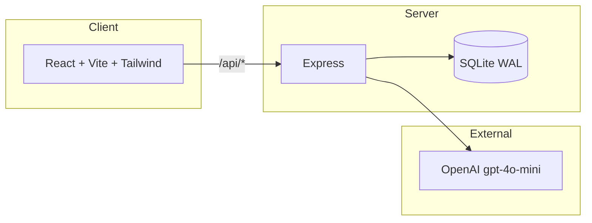
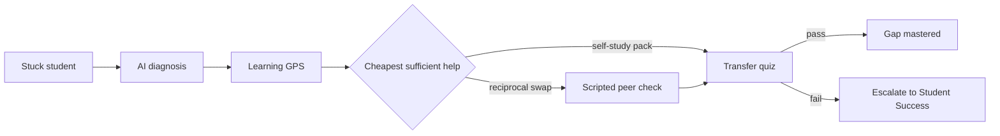
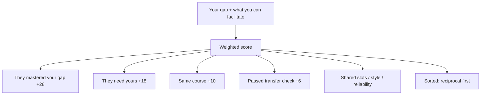

# SwapGap

AI-powered triage for first-year university students: diagnose the misconception, map it on a Learning GPS, route a scripted peer check, then verify — or escalate to Student Success.

We won the Potential Solution Award for QLD State Round.

Link to our presentation: [Slide](https://canva.link/gafi9mku5dyn0dj)

Our app is live on: [SwapGap](https://swapgap.onrender.com/)

## Architecture



Production is one Node process: Express serves the Vite build and the API from the same origin.

## Quick Start

> [!IMPORTANT]
> You need [Node.js 20+](https://nodejs.org/) (22 recommended). An OpenAI key is optional — the nested-loop judge walkthrough works without it.

```bash
git clone https://github.com/volam1311/SwapGap.git
cd SwapGap
cp server/.env.example server/.env
npm install
npm run install:all
npm run dev
```

| Service | URL | Description |
|---------|-----|-------------|
| Web app | http://localhost:5173 | Vite + React |
| API | http://localhost:4000 | Express |
| Health | http://localhost:4000/api/health | `{ ok, openai }` |
| Public credential | http://localhost:5173/c/GS-2026S2-MAYA | No login required |

Vite proxies `/api/*` to port 4000. Ctrl+C stops both processes.

To run them in separate terminals instead:

```bash
cd server && npm run dev
cd client && npm run dev
```

> [!TIP]
> People on the same Wi‑Fi can open the **Network** URL Vite prints (for example `http://192.168.x.x:5173`). Campus networks (including QUT) often block phones from reaching laptops. If it hangs, keep `npm run dev` running and in a **second** terminal run `npm run share` — that prints a public `https://….trycloudflare.com` link.

## Demo login

The database seeds itself if it is empty. Use **Continue as Maya** / **Continue as Alex** on the login page, or sign in with:

| Role | Email | Password | Gap / teach |
|------|-------|----------|-------------|
| Maya | `maya@qut.edu.au` | `gapswap` | Needs Nested loops, facilitates Functions |
| Alex | `alex@qut.edu.au` | `gapswap` | Facilitates Nested loops, needs Functions |

```bash
npm run seed
```

Resets the Maya / Alex demo pair.

## Configuration

Copy `server/.env.example` to `server/.env`:

| Variable | Default | Description |
|----------|---------|-------------|
| `OPENAI_API_KEY` | _(empty)_ | Diagnosis checkpoints, session hints, transfer-quiz generation |
| `JWT_SECRET` | `gapswap-dev-secret` | Signs auth tokens (change in production) |
| `PORT` | `4000` | API port |
| `DATA_DIR` | `server/data` | SQLite file location |

> [!NOTE]
> Without an OpenAI key, diagnosis falls back to the built-in nested-loop checkpoints and misconception. The judge walkthrough stays intact.

## Product loop



1. Diagnose the misconception — not the assignment answer.
2. Pin it on a prerequisite path (IFB104: Variables → Functions → Loops → Nested loops → Lists).
3. Match a verified peer for a 20-minute reciprocal swap, or route elsewhere.
4. Run a course-approved session pack (worked example, three prompts, one exercise).
5. Verify with a transfer quiz. Fail keeps the node red and attaches a diagnostic profile for Student Success.

## Matching



Swap / help / group / mentor / async modes all reuse the same scorer with different sort rules.

## Project structure

```
SwapGap/
├── client/                     # React + Vite + Tailwind
│   ├── src/
│   │   ├── pages/              # Landing, Diagnose, GPS, Match, Session, Certificate…
│   │   ├── components/         # App shell and shared UI
│   │   ├── api.js              # Fetch wrapper
│   │   └── AuthContext.jsx     # JWT session
│   └── vite.config.js          # Proxies /api → :4000
├── server/
│   ├── src/
│   │   ├── index.js            # Express entry; serves client/dist in production
│   │   ├── db.js               # SQLite schema
│   │   ├── seed.js             # Maya / Alex demo
│   │   ├── middleware/auth.js  # JWT
│   │   ├── routes/             # auth, diagnose, gps, matches, sessions, community, certificate
│   │   └── services/           # OpenAI, concepts, matching, session packs, certificate
│   └── .env.example
├── .github/workflows/          # CI build + Render deploy
├── Dockerfile                  # Production image; SQLite on /data
├── docker-compose.yml          # Named volume so the DB survives rebuilds
├── render.yaml                 # Render Docker web service + persistent disk
└── package.json                # npm run dev | build | start | seed | share
```

## Judge walkthrough

1. Land → **Continue as Maya**.
2. Home → Discover Gaps → keep the inner-loop question and **Use my current unit** → Start diagnosis.
3. Answer three checkpoints → Learning GPS shows **Nested loops** as the red gap.
4. Find a Match → Alex T. (verified Nested loops, pass rate, on-time) → Confirm session, **or** open the already-booked SwapGap with Alex.
5. In another browser, **Continue as Alex** to join the same session from the other side.
6. Join when ready → run the session pack (three prompts + exercise) / switch roles → Ready to verify.
7. Answer the transfer quiz → Nested loops turns **Mastered**, or fail and see the Student Success escalation card.
8. Open **Certificate** — copy a CV bullet or Add to LinkedIn for the Semester 2, 2026 Peer Teaching & Support credential.

> [!TIP]
> The public certificate page `/c/GS-2026S2-MAYA` does not require login. Handy for judges on a phone.

## What is real vs stand-in

| Shipped | Stand-in (called out in the UI) |
|---------|--------------------------------|
| Diagnosis, Learning GPS, three-tier routing | Live two-way video (Jitsi link + local camera preview) |
| Reciprocal matching (swap / help / group / mentor / async) | Full whiteboard |
| Scripted session pack, AI hints, transfer check | Google Calendar OAuth (download `.ics` instead) |
| Student Success escalation, questions board, report/block | University SSO |
| `.edu.au` verification flag, semester certificate | Card charges (Payment page is checkout UI only) |

## CI/CD

Pushing to `main` runs two GitHub Actions workflows:

- **`.github/workflows/ci.yml`** — Node 22, `npm ci`, client build
- **`.github/workflows/deploy.yml`** — Render CLI `deploys create` to the production web service

### Deploy on Render

Express already serves `client/dist`, so judges get one HTTPS `onrender.com` URL. SQLite is stored on a persistent disk at `/data` (see `Dockerfile` / `render.yaml`). Disks need a paid instance — the blueprint uses the smallest one (`0.5c-512mb`).

1. In Render: **New → Blueprint** from this repo (uses `render.yaml`), or create a **Web Service** with **Docker** runtime:
   - Dockerfile path: `./Dockerfile`
   - Health check path: `/api/health`
   - Disk: 1 GB mounted at `/data`
   - Env: `DATA_DIR=/data`
2. In Render **Account Settings → API Keys**, create a key. Copy the web service ID (`srv-…`) from the service URL or Settings.
3. In GitHub: repo **Settings → Secrets and variables → Actions**
   - Secret `RENDER_API_KEY` = that API key
   - Secret or variable `RENDER_SERVICE_ID` = the web service ID
4. In Render service settings, turn **auto-deploy off** so only this workflow ships the app (already set in `render.yaml`).
5. Set `OPENAI_API_KEY` and `JWT_SECRET` on the Render service.

Local production-style run (DB kept in the `swapgap-data` volume):

```bash
docker compose up --build
```

App: http://localhost:4000 — health: http://localhost:4000/api/health

> [!WARNING]
> Render’s free plan cannot attach a disk. Without `/data` on a persistent disk, the SQLite file is wiped on every redeploy and the Maya demo reseeds from scratch.
